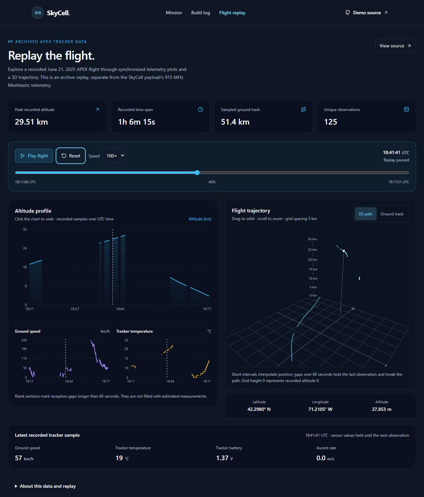

# SkyCell

**First place at Hack Club APEX 2025.**

SkyCell is a high-altitude balloon communications experiment built by **four students**. The mission reached **approximately 30 km altitude** and established a **70 km LoRa / Meshtastic radio link**. The project brought together Python flight software, radio hardware, ground-station logging, and a React / TypeScript flight explorer.

[Explore the demo](https://skycell.vercel.app/) · [Open flight replay](https://skycell.vercel.app/dashboard) · [Flight & ground-station source](https://github.com/knivier/SkyCell)

[](https://github.com/sharonbasovich/skycell/actions/workflows/ci.yml)



This repository contains the **React frontend**: the project showcase, engineering notes, and browser replay. The team's [companion repository](https://github.com/knivier/SkyCell) contains the payload, radio, and flight / ground-station software.

## Explore the flight

Play, pause, reset, or scrub the timeline at **1×, 25×, 100×, or 250× speed**. Follow the position in an interactive 3D trajectory or a north-up ground track while the telemetry charts and current readings follow the same replay clock. Browsers without WebGL 2 use the ground-track view.

The demo replays an archived APEX / SondeHub tracker recording. It runs without a radio receiver, API credentials, or a backend.

## Engineering

**Stack:** React · TypeScript · Vite · Tailwind CSS · React Three Fiber · Three.js · Recharts

```text
CSV archive → validated UTC observations → shared replay clock
                                                ├── 3D / ground trajectory
                                                ├── telemetry charts
                                                └── current readings
```

- **Validated ingestion:** a header-based CSV parser handles quoted fields and missing sensor values, validates timestamps and coordinates, sorts observations, and deduplicates timestamps. Single-payload validation prevents unrelated flights from becoming one track.
- **Timestamp-based playback:** a shared clock drives all views. Binary search selects the current observation; short intervals interpolate position, while reception gaps over 60 seconds hold the last position and break the plotted path.
- **Geographic visualization:** latitude, longitude, and altitude are projected into consistent spatial units for the Three.js trajectory. Orbit controls support rotation and zoom; an SVG ground track provides a fallback.
- **Responsive loading and failure handling:** the dashboard and 3D code load separately from the showcase. Failed archive requests and invalid data produce explicit retry states.

The **16 regression tests** cover CSV parsing, UTC offsets, duplicate observations, mixed payloads, reception gaps, HTTP failures, the bundled archive, and seeking during playback. GitHub Actions runs ESLint, Vitest, strict TypeScript checks, and the production build on pushes and pull requests.

## Archive provenance

The bundled [`public/data.csv`](public/data.csv) contains **125 APEX-2-T observations from June 21, 2025**, exported from the APEX tracker / SondeHub data. It spans **18:11:06–19:17:21 UTC** and records a peak altitude of **29,510 m**.

This tracker archive uses **Horus Binary v2 around 432.625 MHz** and is separate from SkyCell's **915 MHz mesh payload telemetry**. The browser demo displays a partial flight recording rather than a live radio feed. Sensor values remain the latest received readings; interpolated positions are estimates between nearby observations. See [data documentation](docs/data.md) for the schema, source, and replay semantics.

## Run locally

Use **Node.js 24** (the CI version) or Node.js 22.12+ and npm.

```bash
git clone https://github.com/sharonbasovich/skycell.git
cd skycell
npm ci
npm run dev
```

Open [http://localhost:8080](http://localhost:8080).

| Command              | Purpose                                               |
| -------------------- | ----------------------------------------------------- |
| `npm run typecheck`  | Check application and configuration types             |
| `npm run lint`       | Run ESLint                                            |
| `npm test`           | Run the regression tests                              |
| `npm run test:watch` | Re-run tests while developing                         |
| `npm run build`      | Type-check and build the production bundle in `dist/` |
| `npm run preview`    | Preview the production bundle locally                 |

## Deployment

The [live demo](https://skycell.vercel.app/) runs on Vercel. [`vercel.json`](vercel.json) configures `npm ci`, the checked production build, and direct navigation to `/dashboard` and `/development`. Import this repository into Vercel to deploy another instance; no environment variables are required.
